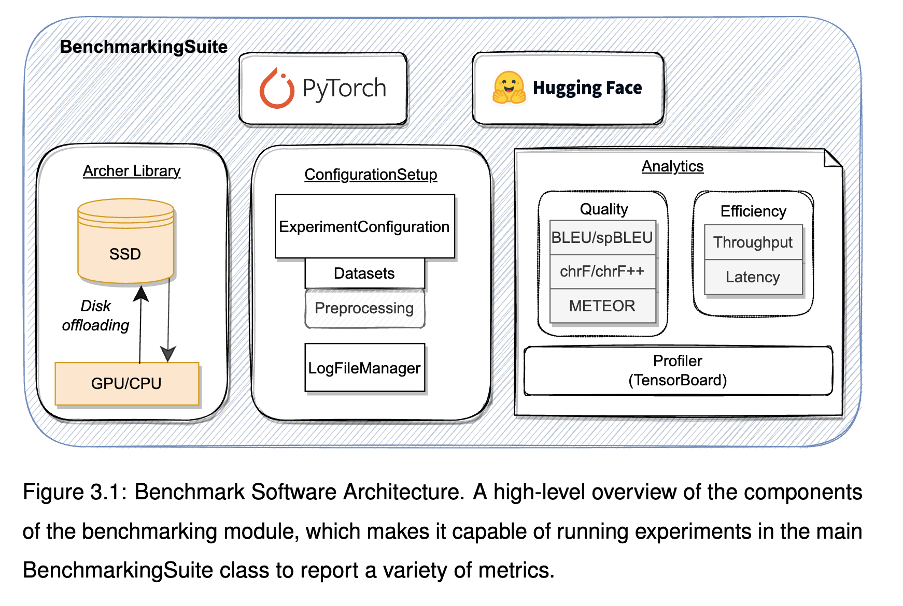

# Benchmarking Large Language AI Models for Machine Translation

The repository contains the code developed for my research dissertation work produced as part of my studies in MSc Artificial Intelligence at the University of Edinburgh 2022-2023. The objective is to create a benchmarking tool to evaluate models by their quality and efficiency of output. In addition, the work done can be used to evaluate the performance of optimisation and inference engines like Deepspeed. The value of the outcome of further iterations of this research is to accelerate the development and running of AI models.

The following excerpt is the abstract extracted from the paper:

> Machine translation, a fundamental task in natural language processing (NLP), holds
exceptional significance as it bridges communication gaps across diverse languages and
cultures. As large language models increase in size, this brings additional computational
costs. Libraries like Archer, a high-performance inference engine, aim to optimise
the deployment of these models to reduce the resource requirements needed to utilise
their predictive capabilities. This research aims to support these tools by developing
a benchmarking suite for machine translation to aid in addressing the bottleneck in
performance, both in terms of the quality of output and the efficiency of model execution.
Through constant refinement, the suite’s architecture embodies a systematic approach
to evaluating machine translation models that can be later expanded to support other
metrics. In addition, the work done provides a building block for benchmarking not
only trained models’ inference runtime, and could be used to help the development of
inference libraries to further the development of assisting with serving machine learning
models. Finally, using the framework, we analyse the results reported from the dense
models T5 and NLLB and then on sparse, larger models such as SwitchTransformer
> and NLLB-MoE deployed using Archer

For more details about the conclusions found from the results and a deeper understanding of the framework, please refer to the PDF Dissertation writeup in the Dissertation folder.

The `submission` branch contains the version submitted at the University of Edinburgh.

https://github.com/wassim2u/Benchmark/blob/main/Dissertation/README_figures/Workflow.pdf

# Table of Content
Please expand the toggle below to view the table of contents.

[Table of Contents](./Dissertation/README_figures/Table_of_Contents_Benchmarking_Large_Language_AI_Models_for_Machine_Translation.pdf)

## Installation 
Please try installing the libraries from `requirements.txt` file. 

For Archer, you will need access to the private library in order to install it for the benchmark and be able to run the benchmarking. However, if not possible, you can comment out the lines that involve Archer, and that would allow you to run it without it.

# Running the Suite
To run the suite with the default settings, please run the `python benchmark_suite.py`. 

To configure between running a single experiment or multiple ones based on the hyperparameters passed in `hyperparameters_config.py` file, please toggle the `sweep=True` under `__main__` in the main file `benchmark_suite.py`. 

# HypeparameterConfiguration
To customise the experiment or configurations wanted, you can find an example of how to configure the parameters of your choice in `hyperparameters_config.py`. 

# Metrics

The following tables contain the benchmarks generated for the running of a model: 

Quality Metrics:
| Metric | Description                                                                                                                                          | Measurement                                                                 |
|--------|------------------------------------------------------------------------------------------------------------------------------------------------------|-----------------------------------------------------------------------------|
| BLEU   | The most widely used MT metric for the ease of its simplicity. Count matching n-grams in the candidate translation to n-grams in the reference text. | $	ext{BLEU} = \text{BP}\cdot\exp \bigg( \sum_{n=1}^{N} w_n \log p_n \bigg)  |
| spBLEU | BLEU score applied to text that has been tokenized using the SentencePiece, aimed to mitigate BLEU's tokenization-dependence                         | $\text{BLEU} = \text{BP}\cdot\exp \bigg( \sum_{n=1}^{N} w_n \log p_n \bigg) |
| chrF   | Using precision and recall of character n-grams, which are sequences of characters of length ”n".                                                    | $    chrF = \frac{(1+\beta^2)*ngrP*ngrR}{\beta^2*ngrP + ngrR}$              |
| chrF++ | chrF score with the inclusion of n-gram words                                                                                                        | $chrF\text{++} = \frac{(1+\beta^2)*ngrP*ngrR}{\beta^2*ngrP + ngrR}$         |
| METEOR | Exact word matching through the calculation of unigram precision and recall to retrieve the harmonic mean                                            | $METEOR = (1 - P_{en}) * F_{mean}$                                          |

Efficiency Metrics:

| Metric     | Overview                                                                                                                                                                                             | Measurement                |
|------------|------------------------------------------------------------------------------------------------------------------------------------------------------------------------------------------------------|----------------------------|
| Latency    | The time it takes to run a single inference in seconds or milliseconds. For each encoder and decoder, it is normalised per token to compute the latency per token for more standardised comparisons. | $L = T_{end} - T_{start} $ |
| Throughput | Number of translations that can be done within a timeframe                                                                                                                                           | $Tp = \frac{N}{\Delta t}$  |

# Software Architecture
The following figure contains the high-level overview of the code produced. 

# Workflow Diagram
For a more better understanding of how the benchmark is run and the datasets used, the following diagram presents the workflow diagram of the suite.

Note: The diagram below was adjusted slightly to include the datasets used for our benchmarking during the duration of my dissertation

[Workflow](./Dissertation/README_figures/Workflow.pdf)

